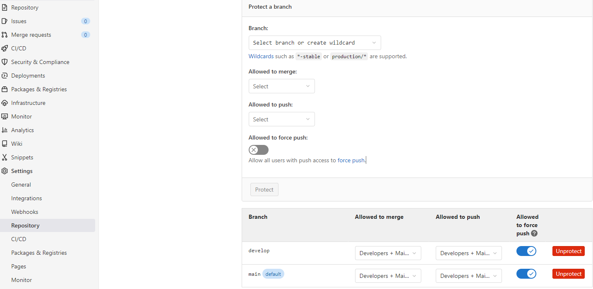
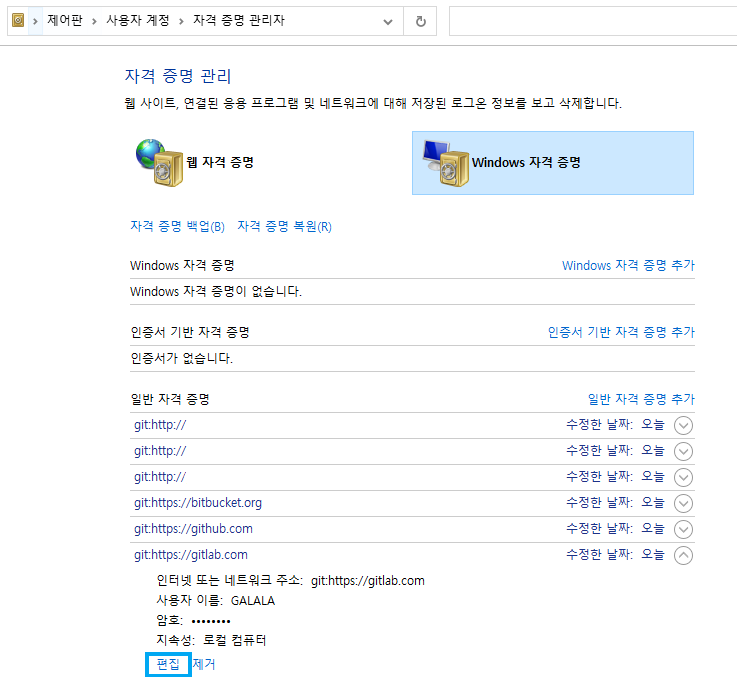

## 💎문제

pull은 잘되는데 아래 메세지가 뜨면서 push만 할 수 없었다💦

> `'you are not allowed to push code to this project.'`

구글링 했을때 가장 많이 나오는 방법은 GitLab-Setting-Repository-**Protected branches**에서 접근 권한을 설정해주고 **Allowed to force push**를 활성화하기인데.. 웬만해선 먹힌다는 방법이 나한텐 먹히지 않았다!🤷



*왜 안되는겨~*


## 🌠해결법

`제어판`>`사용자계정`>`자격증명관리자`>`Windows 자격 증명` 에서 GitLab의 정보를 수정해주면 된다!👩‍🔧

사용자이름과 암호를 올바르게 입력해주면 끝!✨


내 경우엔 기존의 Gitlab 정보가 저장되어있었는데 이번에 새로 계정을 만들면서 정보를 바꿔줄 필요가 있었던것이다~😏





```toc

```
