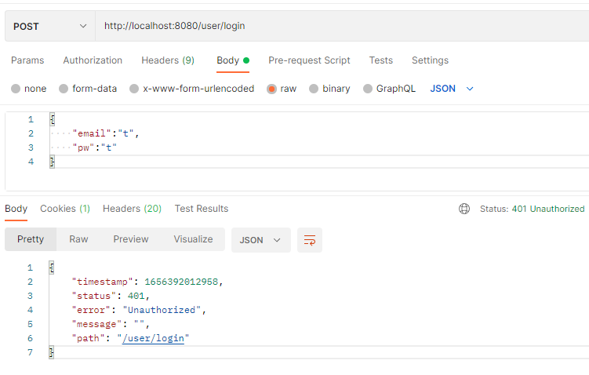
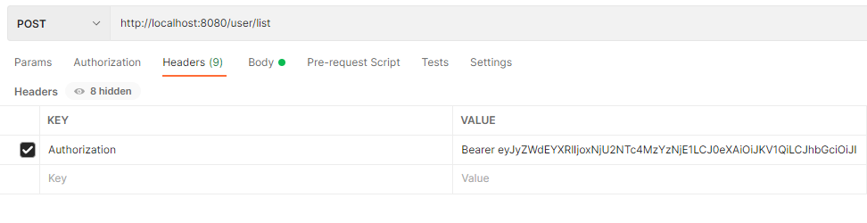

## 🥝문제

JWT가 필요한 API를 포스트맨으로 테스트 할때 그냥 보내면 아래처럼 401 Unauthorized 에러가 뜨게 된다.🤔



## ⭐️해결법

**Headers에 JWT를 담아야 한다!**

KEY에 `Authorization` 를, VALUE에 `Bearer 토큰값`을 입력하면 된다. (Bearer 뒤에 꼭 한칸 띄어야함!)




```toc

```
