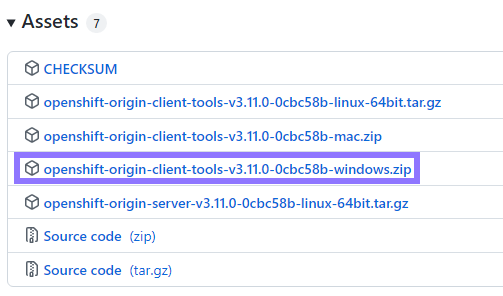
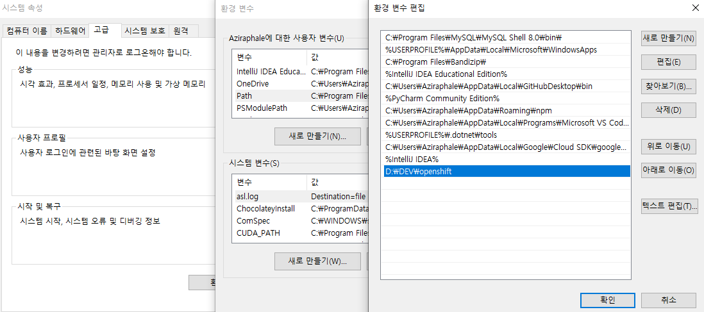
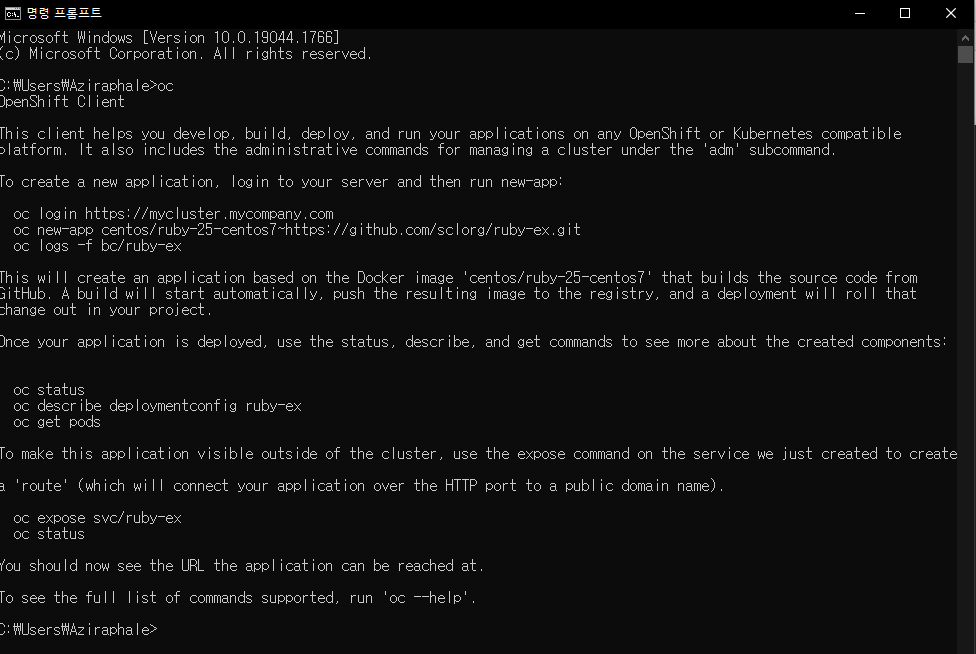

## 🍈OpenShift란?


## 🍠설치방법

1. OpenShift Cli 다운로드

[여기](https://github.com/openshift/origin/releases/tag/v3.11.0)로 들어가서 제일아래에 있는 파일을 받아 압축해제한다.




2. 환경변수 설정

압축 해제한 폴더의 경로를 Path에 추가한다.




3. 확인하기

cmd창을 열어서 oc를 입력했을때 아래처럼 무언가가 길게 나온다면 끝~!

```toc

```
