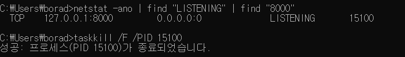

npm start를 계속 하다보면 8000번 포트가 이미 사용중이라고 뜰때가 있다.

이럴땐 cmd창을 켜서 아래 명령어를 입력하면 된다.

```
netstat -ano | find "LISTENING" | find "포트번호"

taskkill /F /PID PID번호
```

첫번째 명령어를 입력하면 아래 사진처럼 해당 포트번호의 PID번호를 알수있는데(매번 바뀜) 그 번호를 두번째 명령어에 넣으면 된다.


