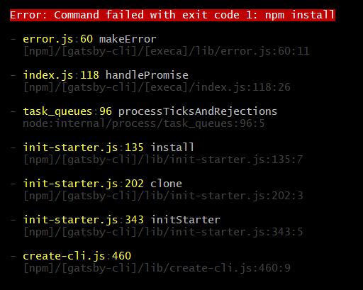
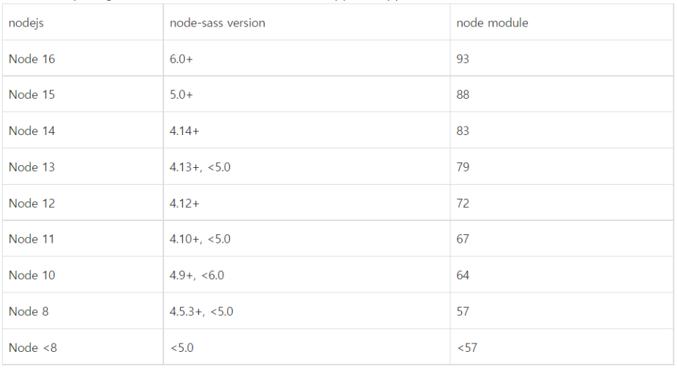
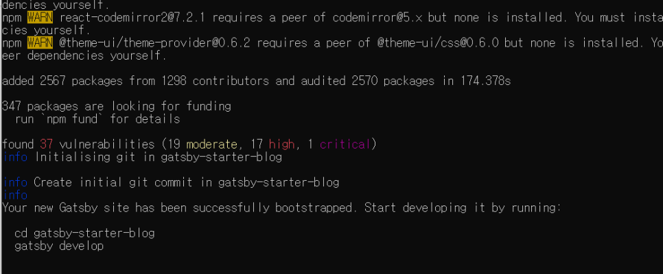

개츠비로 깃블로그를 만드려는데 이런 에러가 떴다.



# 해결법

node버전을 14.15.0으로 낮추고 node-sass를 4.14이상 버전으로 설치하면 된다.

1. node 버전 낮추기

```
C:\Windows\system32>node -v
v16.13.2

C:\Windows\system32>nvm install 14.15.0
Downloading node.js version 14.15.0 (64-bit)...
Complete
Creating C:\Users\borad\AppData\Roaming\nvm\temp

Downloading npm version 6.14.4... Complete
Installing npm v6.14.4...

Installation complete. If you want to use this version, type

nvm use 14.15.0

C:\Windows\system32>nvm use 14.15.0
Now using node v14.15.0 (64-bit)

C:\Windows\system32>node -v
v14.0.0
```

2. node sass를 호환되는 버전으로 설치하기

위에서 node.js를 14.15.0으로 설치했으니까 node-sass는 4.14이상인걸 설치하면 된다.

나는 node-sass를 최신버전으로 설치했다.

```
# node-sass 삭제 후 새로 설치 
$ npm uninstall node-sass 
$ npm install --save node-sass 

# 최신버전 설치 확인 
$ npm list | grep node-sass ├── node-sass@5.0.0
```



이제 에러가 안뜬다!


