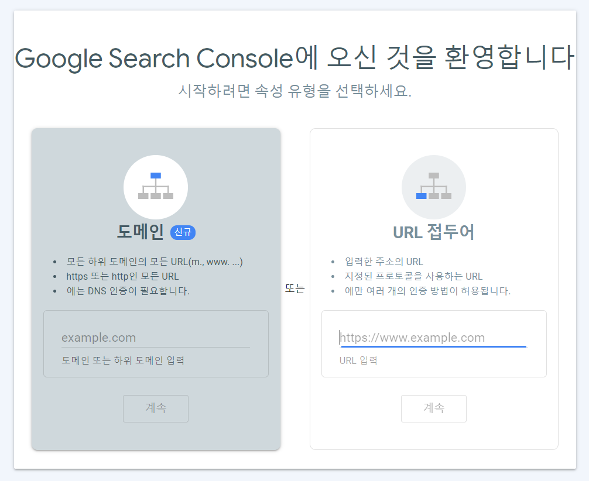
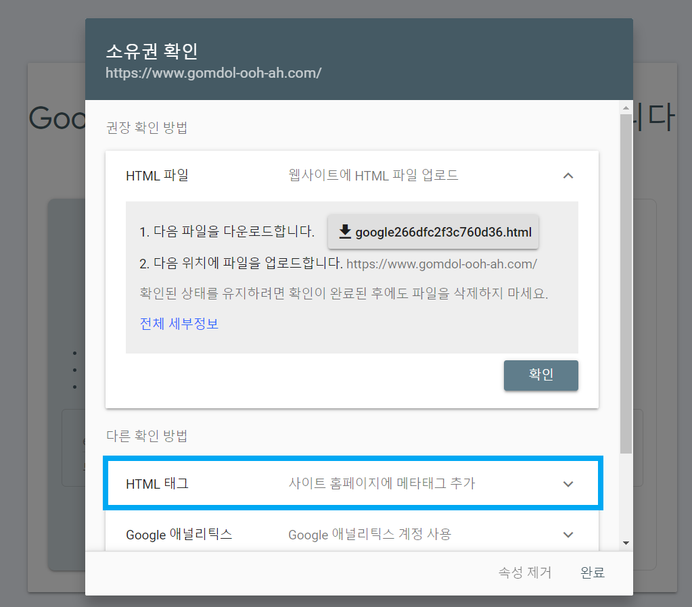
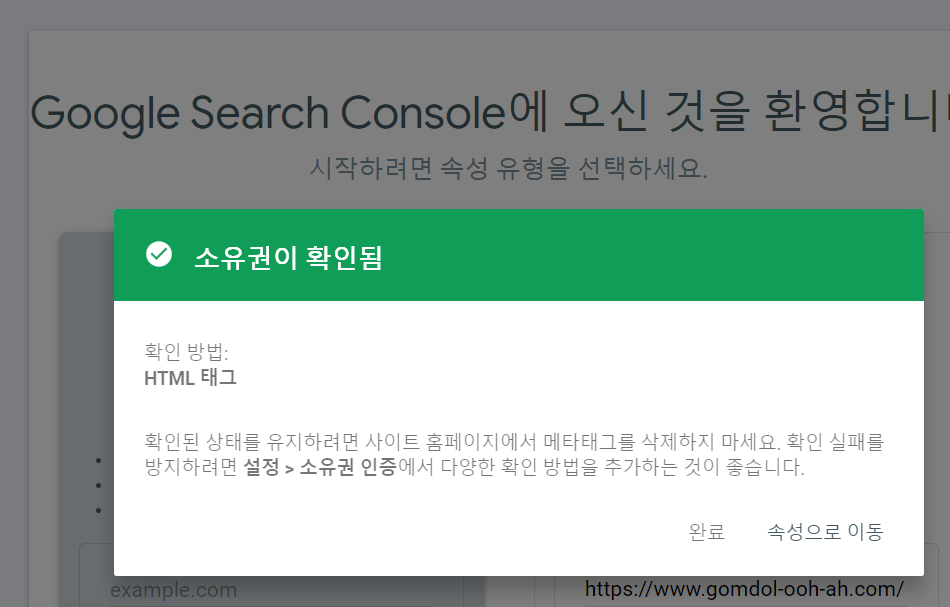
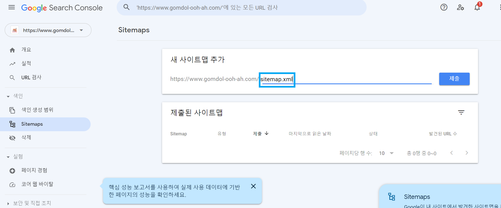

블로그를 구글 검색엔진에 노출시키려면 **Google Search Console**이 필요하다.😍

구글 계정만 있으면 무료로 사용할 수 있다~!💸


## 🚥Google Search Console 사용법

1. 시작하기🍳

   우선 [Google Search Console](https://search.google.com/search-console/about?hl=ko)에 들어가서 '시작하기'를 누르면 이런 창이 뜨는데, 자신의 도메인 주소를 'URL 접두어'칸에 넣고 '계속'을 누른다.👇




2. HTML태그 복사🍒

   이 창이 뜨면 'HTML 태그'를 클릭해서 내용물을 복사한다.✍




3. index.jsx에 붙여넣기🐟

개츠비 블로그가 있는 로컬 폴더에 들어가 `.\src\components\head\index.jsx`를 열어서 아래 위치에 복사한 내용을 붙여넣기한다.🧐

```jsx
export function Head({ description, lang, meta, keywords, title }) {
  return (
    <StaticQuery
      query={detailsQuery}
      render={data => {
        const metaDescription =
          description || data.site.siteMetadata.description
        return (
          <Helmet
            htmlAttributes={{
              lang,
            }}
            title={title}
            titleTemplate={`%s | ${data.site.siteMetadata.title}`}
            meta={[
              //여기에 아래 내용 추가//
              {
                name:  `google-site-verification`,
                content: "복사한 내용 중 content 부분을 붙여넣기",
              }
              /////////////////////
            ]
              .concat(
                keywords.length > 0
                  ? {
                      name: `keywords`,
                      content: keywords.join(`, `),
                    }
                  : []
              )
              .concat(meta)}
          />
        )
      }}
    />
  )
}
```


4. 소유권 확인🌙

`index.jsx`를 수정한 뒤 Github에 푸시하고 Google Search Console페이지로 돌아와 '확인'버튼을 누르면 소유권이 확인되었다는 알림이 뜬다!🎵




5. sitemap.xml 입력 후 제출🍭

왼쪽에 있는 메뉴 중 Sitemaps를 클릭해서 사이트맵 URL을 입력하는 위치에 `sitemap.xml`을 입력하고 제출을 누르면 된다!😋




```toc

```
