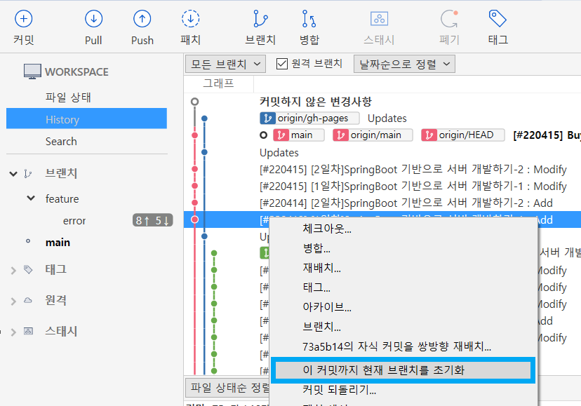
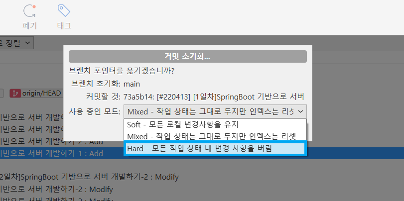

작업하다보면 푸시한걸 취소하고 싶을 때가 있다.😐

나는 소스트리를 많이쓰니까 소스트리에서 어떻게 해야하는지 기록해봤다~~!!🧙‍♀️


## 🍀방법

##### 🍩1. 되돌리고 싶은 시점에서 '이 커밋까지 현재 브랜치를 초기화' 클릭




##### 🎂2.'Hard-모든 작업 상태 내 변경사항을 버림' 선택




##### 🍰3.변경사항 작성 후 커밋


##### 🧁4.터미널을 열고 아래 명령어로 강제로 푸시하기

```
git push --force origin main
```


##### 🍮5.되돌리기 성공!


```toc

```
